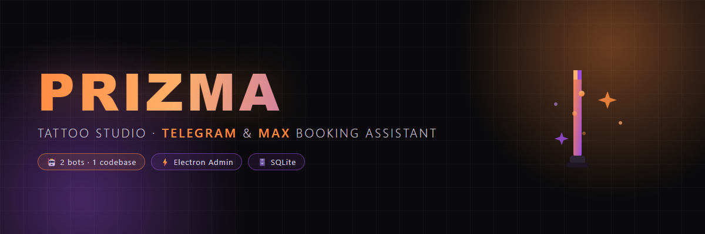
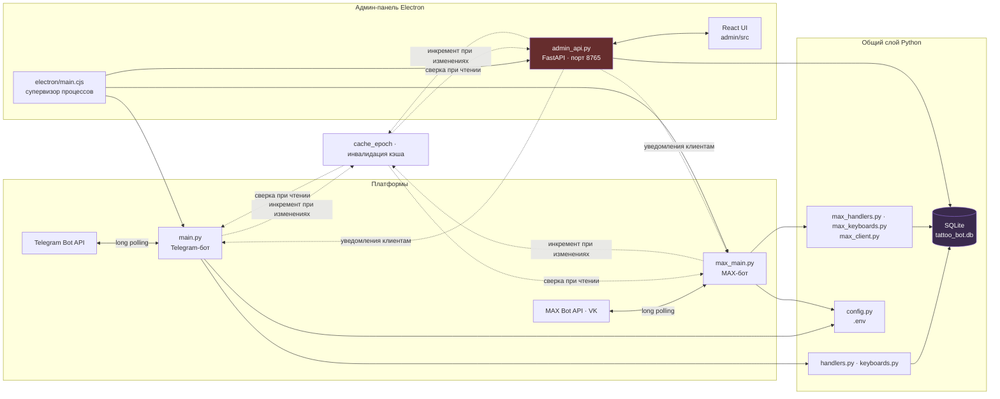
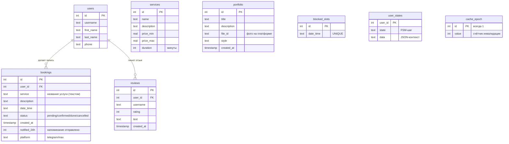
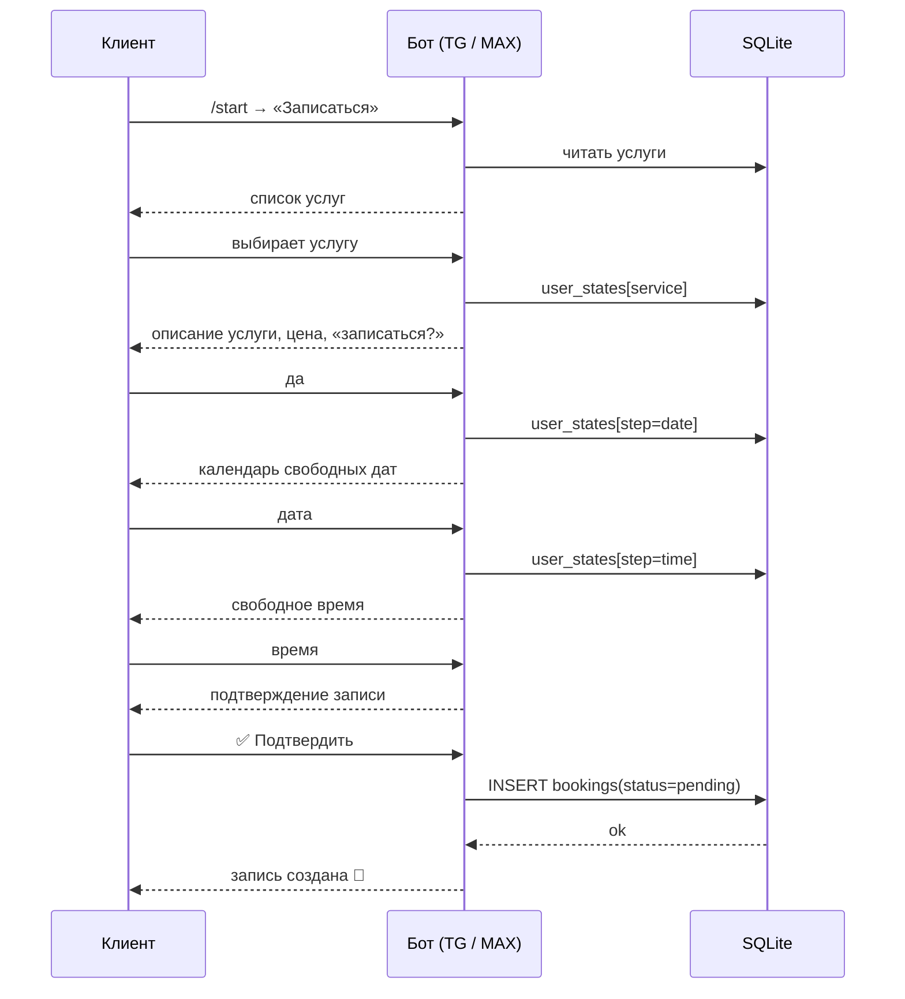

<p align="center">
  
</p>

# 💉 PRIZMA — тату-студия: чат-боты для Telegram и MAX + админ-панель

Полноценная система онлайн-записи для тату-студии: **два чат-бота** (Telegram и MAX / VK-мессенджер) из одной кодовой базы, **общая база данных** и **настольная админ-панель** (Electron) для управления записями, портфолио, отзывами и слотами.

> 🌐 **Telegram-бот:** [@tatoo_asbest_best_bot](https://t.me/tatoo_asbest_best_bot) · **MAX-бот:** username `@se14062955_bot` (искать в приложении MAX)

---

## ✨ Возможности

### 🤖 Для клиентов
| Возможность | Telegram | MAX |
|---|---|---|
| 🎨 Просмотр портфолио работ | ✅ | ✅ |
| 📅 Онлайн-запись (календарь, выбор времени) | ✅ | ✅ |
| 💰 Прайс-лист услуг и цен | ✅ | ✅ |
| ⭐ Отзывы: просмотр и оставление | ✅ | ✅ |
| 👤 Мои записи: просмотр и **отмена** | ✅ | ✅ |
| ℹ️ О мастере, контакты, как добраться | ✅ | ✅ |

### 🧑‍💻 Для мастера (админа)
- 🔧 **Админ-панель** — отдельное настольное приложение (Windows, portable-exe)
- 📋 Просмотр всех заявок: подтверждение, завершение, отмена, сообщение клиенту
- 🚫 **Блокировка слотов** — вручную закрывать неудобные даты/время
- ⭐ Управление отзывами: публикация, ответ, удаление
- 🔔 **Авто-напоминания** клиенту за 24 часа до записи
- 📊 **Утренняя сводка** админу: все записи на день (8:00–12:00)

### ⚙️ Общее
- 💾 Общий `SQLite` — клиенты TG и MAX видят **одно** портфолио, **один** прайс и **одну** админ-панель
- 🧵 Каждый бот — независимый процесс; падение одного не роняет другой
- 📝 Хранит состояние каждого клиента (FSM) — запись можно прервать и продолжить

---

## 🏗️ Архитектура



**Как это работает:**
1. **Боты** (`main.py`, `max_main.py`) висят на long polling своих платформ и обслуживают клиентов: меню, запись, отзывы, «мои записи».
2. **Общая БД** — единственный источник правды. Всё, что сделал клиент в TG, видно в MAX и в панели.
3. **Админ-панель** — Electron-приложение. Его супервизор сам поднимает `admin_api.py` (FastAPI на `:8765`), а при необходимости — и ботов. UI (React) через REST API читает/меняет записи и шлёт уведомления клиентам через ботов.

> 💡 **Про кэш:** боты и панель работают в разных процессах и держат in-memory кэш. Любой записывающий процесс инкрементирует счётчик `cache_epoch` в БД — остальные при каждом чтении сверяют свою эпоху и инвалидируют кэш. Это держит данные синхронными без перезапусков.

---

## 🗄️ Схема базы данных



> 📌 Услуга в записи хранится **названием** (`service` TEXT), а не внешним ключом — прайс живёт отдельно в `services`.

---

## 📥 Поток записи клиента (FSM)



---

## 🛠️ Технологии и зависимости

### Python (серверная часть)
| Пакет | Версия | Зачем |
|---|---|---|
| **Python** | 3.10+ | рантайм |
| `pyTelegramBotAPI` | 4.36.1 | работа с Telegram Bot API |
| `requests` | >=2.31 | HTTP-клиент для MAX Bot API |
| `python-dotenv` | 1.0.0 | загрузка `.env` |
| `fastapi` + `uvicorn[standard]` | >=0.115 / >=0.30 | REST API админ-панели |
| `textual` / `rich` | >=8.0 / >=14.0 | консольный TUI-дашборд бота (`overlay.py`) — косметика, на работу не влияет |
| `sqlite3` | встроен в Python | база данных, ничего ставить не нужно |
| `pytest` | >=8.0 | тесты (dev) |

### Node.js (только админ-панель)
| Пакет | Версия | Зачем |
|---|---|---|
| **Node.js** | 18+ | рантайм сборки |
| `electron` | ^33.2 | оболочка панели + супервизор процессов |
| `react` / `react-dom` | ^18.3 | интерфейс панели |
| `vite` | ^6.0 | dev-сервер и сборка фронта |
| `electron-builder` | ^26.15 | сборка portable `.exe` |

---

## 🚀 Установка и запуск

### Системные требования
- **Windows 10/11** (основной таргет; Python-часть кроссплатформенная)
- **Python 3.10+** ([python.org](https://www.python.org/downloads/)) — при установке обязательно галочка **«Add Python to PATH»**
- **Node.js 18+** — только если собираешь/запускаешь админ-панель из исходников ([nodejs.org](https://nodejs.org/))

### Шаг 1. Клонирование
```bash
git clone https://github.com/fakingpescobar-ctrl/tattoo-studio-bot.git
cd tattoo-studio-bot
```

### Шаг 2. Зависимости Python + настройка

**Вариант А — автоматический (рекомендуется):**
```bash
install.bat
```
Скрипт делает всё сам: ставит пакеты из `requirements.txt`, создаёт `.env` из `.env.example` и инициализирует базу с демо-данными.

**Вариант Б — вручную:**
```bash
# 1. Пакеты
pip install -r requirements.txt

# 2. Файл конфигурации (обязательно!)
copy .env.example .env

# 3. База данных (демо-услуги и портфолио; функция идемпотентна —
#    повторный запуск ничего не задублирует)
python -c "from database import init_db, add_sample_data; init_db(); add_sample_data()"
```

> ⚠️ Без шага 2 и 3 бот не заработает: не будет токенов и пустой БД.

### Шаг 3. Заполни `.env`
Открой `.env` в блокноте. Обязательные поля:

| Переменная | Обязательна | Описание |
|---|---|---|
| `BOT_TOKEN` | ✅ (для TG) | токен Telegram-бота (см. Шаг 4) |
| `ADMIN_ID` | ✅ | твой Telegram ID; можно несколько через запятую: `111,222` |
| `MAX_TOKEN` | для MAX | токен MAX-бота (см. Шаг 4) |
| `MAX_ADMIN_ID` | для MAX | твой персональный ID в мессенджере MAX (не токен!) |

Опциональные (бренд, контакты, пути — полный список в `.env.example`):

| Переменная | Что задаёт |
|---|---|
| `DB_PATH` | путь к базе (по умолчанию `tattoo_bot.db`) |
| `BOT_NAME` | имя в консольном баннере (по умолчанию `PRIZMA`) |
| `BOT_MASTER` | имя мастера в разделе «О мастере» |
| `BOT_HANDLE` / `MAX_BOT_HANDLE` | username ботов без `@` |
| `BOT_ADDRESS`, `BOT_PHONE`, `BOT_CITY` | адрес, телефон, город студии |
| `BOT_VK_URL`, `BOT_VK_LABEL` | ссылка на VK и её подпись |

### Шаг 4. Получение токенов

**Telegram:**
1. Открой [@BotFather](https://t.me/BotFather) → `/newbot` → следуй шагам
2. Скопируй **токен** в `BOT_TOKEN`
3. Свой Telegram ID узнай у [@userinfobot](https://t.me/userinfobot) → в `ADMIN_ID`

**MAX (мессенджер VK):**
1. Зайди на [business.max.ru](https://business.max.ru) → «Чат-боты»
2. «Расширенные настройки» → создай бота → скопируй **токен бота** в `MAX_TOKEN`
3. **`MAX_ADMIN_ID`** — это не токен и не ID кабинета, а твой личный ID в мессенджере MAX. Проще всего: напиши любому MAX-боту `/start` — в ответе бота будет твой ID.

### Шаг 5. Запуск ботов

**Только Telegram:**
```bash
python main.py
```

**Только MAX:**
```bash
python max_main.py
```

**Оба сразу:** запусти обе команды в разных окнах — они делят одну БД.
(Это ручной запуск. Если используешь админ-панель — она сама поднимет ботов, см. ниже.)

> 🪄 `start_bot.bat` — быстрый рестарт TG-бота: сам убивает старые python-процессы проекта и запускает нового.
> 📺 В консоли каждого бота — живёт TUI-дашборд (`overlay.py`: ASCII-арт, статистика). Это косметика. Свой арт — положи рядом файл `ascii-art.txt` (или `art.txt`).

---

## 🖥️ Админ-панель (Electron)

### Вариант A — готовый `.exe` (проще всего)
1. Скачай `PRIZMA-Admin.exe` из [Releases](https://github.com/fakingpescobar-ctrl/tattoo-studio-bot/releases)
2. Панель работает с **папкой проекта**: переменная окружения `PRIZMA_PROJECT_ROOT` (в собранной сборке по умолчанию `C:\Projects\tattoo_bot`). Если проект лежит не там — задай `PRIZMA_PROJECT_ROOT` равным своей папке: `setx PRIZMA_PROJECT_ROOT "D:\путь\к\проекту"` (или пересобери exe со своим путём)
3. Запусти. Приложение само:
   - найдёт Python (сначала env `PRIZMA_PYTHON`, затем `%USERPROFILE%\anaconda3\python.exe`, затем `python` из PATH) — и станет под управляемыми им процессами: `admin_api.py` + боты (`main.py`, `max_main.py`)
   - перед стартом аккуратно прибьёт свои старые процессы (защита от конфликта портов), дождётся токена API (`.api-token`) и откроет окно
   - все выводы процессов пишет в `logs/` внутри папки проекта (`admin_api_stdout.log`, `tg_bot_stdout.log`, `max_bot_stdout.log`)

  ⚠️ **Зависимости панель НЕ ставит.** Установи их заранее (Шаг 2): `pip install -r requirements.txt`. Если Python не найден или пакетов нет — процесс упадёт, причина будет в соответствующем логе `logs/`.

### Вариант B — из исходников (для разработки)
```bash
cd admin
npm install            # если electron не скачался — node node_modules\electron\install.js
npm run dev            # dev-режим: Vite + Electron + супервизор
```
Сборка portable-EXE:
```bash
npm run dist           # → admin/release/PRIZMA-Admin.exe
```

### Что умеет панель
| Раздел | Возможности |
|---|---|
| 📋 Записи | список, фильтры по дате/статусу; подтвердить / завершить / отменить / написать клиенту |
| 📷 Портфолио | добавление, редактирование, удаление работ |
| ⭐ Отзывы | просмотр, публикация/скрытие, ответ, удаление |
| 📅 Слоты | блокировка/разблокировка дат и времени |
| 📊 Дашборд | статистика, статусы ботов (живой индикатор) |

---

## 🗂️ Структура проекта

```
tattoo-studio-bot/
├── main.py              # Telegram: точка входа
├── handlers.py          # Telegram: обработчики команд/колбэков
├── keyboards.py         # Telegram: inline-клавиатуры
│
├── max_main.py          # MAX: точка входа
├── max_handlers.py      # MAX: обработчики событий
├── max_keyboards.py     # MAX: клавиатуры
├── max_client.py        # MAX: HTTP-клиент Bot API
│
├── admin_api.py         # FastAPI REST :8765 (для админ-панели)
├── database.py          # общий SQLite-слой (обе платформы) + миграции
├── overlay.py           # ASCII/TUI баннер консоли
├── config.py            # загрузка .env (TG + MAX)
│
├── admin/               # Electron-панель
│   ├── electron/
│   │   ├── main.cjs         # супервизор: поиск Python, запуск api/ботов,
│   │   │                    #   порт-гейт (зависимости ставит не он!)
│   │   └── preload.cjs      # безопасный мост renderer ↔ main
│   ├── dev.mjs              # dev-запуск (Vite + Electron)
│   ├── package.json
│   └── src/                 # React UI (Vite)
│
├── assets/              # брендинг (баннер README)
├── tests/test_database.py   # тесты БД (40 шт.)
├── requirements.txt
├── .env.example
├── install.bat          # установка в один клик (пакеты + .env + БД)
└── start_bot.bat        # рестарт TG-бота с убийством старых процессов
```

---

## ✅ Тесты

```bash
pytest tests/ -v
```
40 тестов БД: записи, слоты, отзывы, статусы, удаления (актуальное число сверяй: `pytest tests/ --collect-only -q` → `40 tests collected`).

---

## 🔧 Кастомизация

| Хочешь | Куда смотреть |
|---|---|
| Инфо о мастере | секция «О мастере» в `handlers.py` / `max_handlers.py` |
| Свой ASCII-баннер консоли | файл `ascii-art.txt` / `art.txt` рядом с проектом |
| Цены и услуги | база `services` (пока **только через код/БД**: `add_sample_data()` в `database.py` или редактирование таблицы) |
| Портфолио и отзывы | можно прямо в админ-панели |

> 🗑️ `add_sample_data()` при первичной установке заливает **демо-услуги и работы** — после настройки удали их и добавь свои (через панель или БД).

---

## 🆘 FAQ / Поддержка

**Где логи?**
Два места:
- `bot.log` / `bot.log.1-3` (Telegram), `max_bot.log` (MAX) — **внутренние логи самих ботов**, лежат в корне проекта
- `logs/` внутри папки проекта — **stdout управляемых панелью процессов**: `admin_api_stdout.log`, `tg_bot_stdout.log`, `max_bot_stdout.log` (если запускал панель)

**Бот не отвечает**
- Проверь логи; токены в `.env` должны быть валидными — без `BOT_TOKEN` бот даже не запускается

**Записи не появляются в админке**
- Убедись, что `main.py` / `max_main.py` запущены — панель читает ту же БД
- Панель и проект должны использовать один `DB_PATH` — проверь `PRIZMA_PROJECT_ROOT` и `.env`

**Порт 8765 занят**
- При старте панель сначала убивает свои прежние процессы (preflight) и даёт порту до ~3 сек на освобождение
- Если порт всё ещё занят — панель считает, что `admin_api.py` запущен вручную (внешний), и **подключается к нему, не плодя второй**. Если это «чужой» процесс — убей его через Диспетчер задач (проверь, что CommandLine указывает на твой `admin_api.py`)

**Панель видит записи, но уведомления клиенту не уходят**
- Боты не запущены или токены невалидны — панель шлёт уведомления через них

---

<p align="center"><i>Сделано с любовью к тату-искусству 💉🎨</i></p>